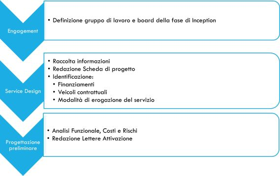

# Ciclo di Sviluppo Agile

Il ciclo di sviluppo in modalità Agile è basato su tre fasi:

* Inception
* Avvio del progetto
* Attività di sviluppo iterativo
  * Sprint Zero
  * Sprint 1-N

## Inception

La fase di Project Inception ha l'obiettivo di raccogliere le informazioni necessarie per qualificare il progetto al fine della valutazione sulla fattibilità o meno dello stesso.

In questa fase sono analizzate le informazioni essenziali per:

* **Ambito**: l'ambito in cui è inserito il progetto;
* **Cosa**: la descrizione di cosa deve risolvere e/o fare il sistema da realizzare;
* **Chi**: gli attori coinvolti e beneficiari di quanto in programma;
* **Perché**: I vantaggi e benefici previsti per ogni stakeholder al termine delle attività;
* **Note generali**: Tutto ciò che contribuisce a dare valore alla sintesi.

Al termine della fase 'Inception' l'Amministrazione valuta se approvare il progetto e allocare le risorse dedicate alla realizzazione dello stesso.

La fase 'Inception' è la prima fase del ciclo di sviluppo di un prodotto e viene avviata alla luce di:

* Piano strategico dell'Amministrazione;
* esigenze di nuovi servizi;
* opportunità e i bisogni espressi dagli Stakeholder;
* richieste di supporto ai processi di business da parte degli stakeholder.

Partecipano a questa fase i seguenti soggetti:

* Responsabile del CED o suo delegato;
* PMO;
* Product Owner (PO);
* Product Owner Team (POT);
* RUP e DEC dei contratti su cui attivare le attività;
* Eventuali team tecnici dei Partner e dei Fornitori;
* Eventuali Stakeholder;

Le attività principali sono:

* identificare i requisiti iniziali;
* determinare i benefici attesi dagli stakeholder;
* valutare i potenziali rischi e le azioni per mitigarli;
* valutare una stima dei costi e dei tempi di realizzazione del progetto proposto;
* raccogliere e formalizzare le informazioni necessarie al Business Case da approvare;
* supportare l'impostazione e l'organizzazione complessiva all'attuazione del progetto (qualora fosse approvato);
* individuare le modalità di

  * sviluppo del servizio
  * erogazione del servizio
  * supporto al servizio
  * redigere le bozze delle lettere di attivazione sui diversi contratti.

La fase produrrà, oltre alla documentazione tecnica di seguito descritta, un documento di sintesi, denominato "<Cod. Progetto> - Executive Summary", da presentare al Direttore del CED e/o altri soggetti che contiene le informazioni salienti scaturite dal lavoro di inception.

In caso di approvazione del progetto sarà avviata la fase di realizzazione.

L'analisi di business e funzionale e il disegno della soluzione tecnica prodotte dalla fase di Inception sono il materiale di input per supportare la realizzazione del progetto.

### Articolazione della Fase Inception

La fase di Inception si suddivide in tre sottofasi:

* Engagement
* Service Design
* Progettazione preliminare

Il diagramma riporta la sequenza delle fasi previste per l'Inception con la rappresentazione degli obiettivi e relativi output delle stesse.

