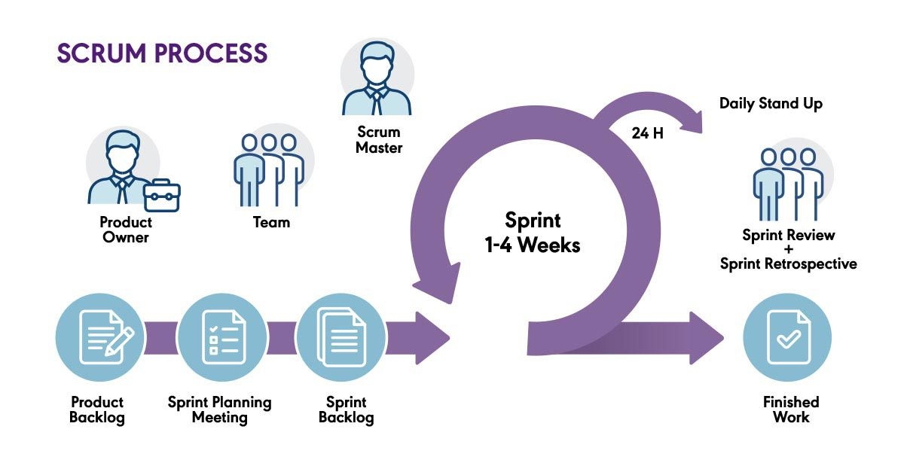
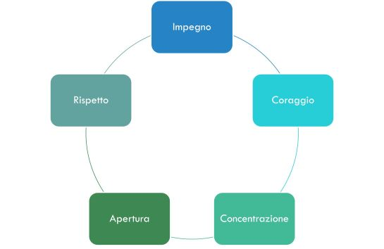

## L'approccio Agile

### Intoduzione al Framework Scrum

La metodologia Agile Scrum è una metodologia di project management che utilizza cicli di sviluppo brevi, denominati “sprint”, per concentrarsi sul miglioramento continuo nello sviluppo di un prodotto o servizio.

Scrum, con le caraterizzazioni fornite nel presente documento, è la metodologia Agile scelta dall’Amministrazione per realizzare i propri progetti.

Il Framework Scrum raccoglie un insieme di pratiche consolidate, a supporto dello sviluppo di prodotti software complessi. Scrum si connota quindi come "un framework per sviluppare e sostenere prodotti complessi", come viene definito dalla guida ufficiale ([https://www.scrumguides.org](https://www.scrumguides.org)) e fa parte delle metodologie Agile, di cui rappresenta la versione di gran lunga più diffusa.

Tali pratiche, consistono nel definire un vero e proprio "percorso" in grado di agevolare le interazioni tra i membri del team al fine di massimizzare la produzione di valore verso gli Stakeholders.

Scrum si basa sulla teoria del controllo empirico, la quale consiste nel definire le proprie decisioni su ciò che deriva dalle esperienze pregresse.

Scrum implementa questa teoria mediante un approccio iterativo ed incrementale, come suggerito dalle pratiche Agile, al fine di gestire in modo efficiente la prevedibilità del rischio e di adattarsi alle esigenze riscontrate durante le attività di sviluppo, il che garantisce l’ottimizzazione e il raffinamento degli obiettivi finali inserendo un grado di dinamismo progettuale necessario a modellare le features in dipendenza delle nuove necessità o di quei dettagli definibili solamente mentre si svolgono i lavori.

#### Pilastri

Il Framework SCRUM ha come caratteristica principale un approccio iterativo ed è costruito su tre pilastri fondamentali:

* Trasparenza: la consapevolezza dello stato delle attività svolte dagli altri elementi del gruppo aiuta ciascuna risorsa a conoscere la situazione in corso ed offre la possibilità di poter intervenire a supporto dei colleghi quando richiesto e/o necessario
* Ispezione: la revisione puntuale delle attività aiuta ad avere sempre a disposizione lo stato dei lavori e questo facilita la possibilità di intervento quando necessario e semplifica e consente di pianificare correttamente nuove attività che non erano previste inizialmente, ma che sono sopraggiunte durante lo svolgimento delle attività
* Adattamento: è una delle caratteristiche principali della metodologia Scrum che a differenza di altre metodologie di tipo waterfall, offre la facoltà di adattare gli sviluppi agli eventi o a nuove esigenze permettendo di integrare e programmare correttamente le nuove attività

##### Trasparenza

*"Gli aspetti significativi del processo devono essere visibili e comprensibili ai responsabili del risultato."*

Il principio di trasparenza richiede che tali aspetti siano definiti da uno standard comune, in modo che gli osservatori condividano in modo inequivocabile ciò che viene prodotto.

A tal fine, risulta molto importante l'adozione di un linguaggio comune di riferimento al processo condiviso da tutti i partecipanti e una comune ed univoca "Definizione di Fatto" (Definition of Done - DoD) che disciplina quando un'attività è da considerarsi completata.

##### Ispezione

Il principio di trasparenza prevede che si eseguano frequenti ispezioni degli artefatti e dell’avanzamento delle attività definite nello Sprint Backlog (Sprint Goal) con lo scopo di rilevare deviazioni indesiderate oppure obiettivi che non sono più necessari.

Le operazioni di ispezione devono avere una frequenza tale da non intralciare lo svolgimento delle attività di Sprint e svolte principalmente da chi ha la competenza necessaria ad effettuarle rispetto ad un particolare stadio del lavoro. Ad esempio, durante la fase di analisi dei requisiti la figura indicata è il Business Analyst, e durante la fase di progettazione si aggiunge anche la figura del Software Architect che collabora confrontandosi con l'analista.

##### Adattamento

Coloro i quali sono demandati alle operazioni di ispezione hanno il dovere di analizzare gli ostacoli (Constraint) del processo che risultano al di fuori dei limiti accettabili.

Se tali impedimenti avranno avuto impatti sull'accettazione del prodotto finale, allora il processo e/o il materiale processato devono essere necessariamente rivisti al fine di non incappare nuovamente nell'errore.

Il processo di adattamento derivante deve essere portato a termine il più rapidamente possibile per ridurre al minimo un'ulteriore deviazione e l'accumulo di Debito Tecnico (*Techincal Debt*).

Scrum definisce almeno quattro occasioni formali all'interno dello Sprint per eseguire le operazioni di ispezione e adattamento:

* **Sprint Planning Meeting** - Evento di pianificazione delle attività
* **Daily Meeting** - Evento quotidiano di condivisione delle attività e delle criticità
* **Sprint Review Meeting** - Evento di revisione di ogni sprint terminato
* **Sprint Retrospective Meeting** - Evento di valutazione orientato al miglioramento dei processi

Rispetto a tali incontri,  l'Amministra partecipa attivamente agli incontri relativi allo sprint (Planning, Review e Retrospective), mentre i Partner ed i Fornitori possono valutare liberamente se eseguire o meno il Daily Meeting per allineare il Team di Sviluppo e lo Scrum Master.

#### Valori

La metodologia Scrum introduce dei valori che devono contraddistinguere e guidare le attività del Team, al fine di creare fiducia, stimolare creatività e produttività:

* Impegno
* Coraggio
* Concentrazione
* Apertura
* Rispetto

*“Quando tali valori sono incarnati e vissuti dal Team, i pilastri prendono vita e creano fiducia per tutti.”*

*“I membri del Team imparano ed esplorano tali valori durante il lavoro svolto attraverso gli eventi, i ruoli e gli artefatti.”*

*“L'uso proficuo di Scrum dipende da quanto le persone diventano più esperte nel vivere questi cinque valori.”*

*“I membri del Team sono personalmente dediti al raggiungimento degli obiettivi.”*

*“I membri del Team hanno il coraggio di fare la cosa giusta e di lavorare sui problemi difficili.”*

*“Ognuno si concentra sul lavoro dello Sprint e sugli obiettivi del Team.”*

*“Il Team e le parti interessate concordano di essere aperti a tutto il lavoro e alle sfide relative alla sua esecuzione.”*

*“I membri del Team si rispettano reciprocamente come persone capaci ed indipendenti.”*

### Attori e Ruoli

L'Amministrazione ha individuato alcuni elementi fondanti del Framework Scrum in relazione ad Attori e Ruoli e li ha integrati per rispondere alle esigenze dello sviluppo del SIDT e dell’organizzazione operativa.

Il Framework prevede diversi Attori e Ruoli, taluni definiscono il Product Team, mentre altri riguardano figure satellite facenti parte dell'organizzazione (Quality Assurance, Strategia, ecc..) altri ancora invece facenti parte dei cosiddetti Stakeholders, cioè tutti coloro i quali sono considerati "Portatori di interessi".

il Product Team, un'estensione dello Scrum Team definito dalla metodologia Scrum, è l'elemento fondante del ciclo di sviluppo dei servizi

#### Product Team

Ad ogni Servizio Digitale sarà associato un Product Team composto da quattro attori differenti:

* Un Product Owner;
* Il Product Owner Team;
* Uno Scrum Master;
* Il Development Team.

I Product Team devono essere auto-organizzati e cross-funzionali e devono avere tutte le competenze necessarie per realizzare il lavoro di sviluppo e gestione del prodotto in maniera auto-consistente. Lo scopo, di tale struttura è ottimizzare la flessibilità, la creatività e la produttività.

I Team lavoreranno su iterazioni successive rilasciando i prodotti in maniera incrementale, elaborando le metriche necessarie alla revisione migliorativa del processo ed all’apprendimento costante, sulla base di quanto già precedentemente effettuato.

#### Product Owner

Il Product Owner ha la responsabilità di massimizzare il valore del prodotto risultante dal lavoro svolto dal Development Team.

***La sua figura si occupa di:***

* collaborare, nello svolgimento del ciclo di vita del Prodotto, con i RUP e DEC dei contratti che sottendono alle singole attività ai fini dell’attivazione, dell’esecuzione e della verifica formale delle stesse, supportando i RUP e i DEC nello svolgimento dei loro compiti di indirizzo e controllo;
* acquisire e dettagliare le esigenze di business degli Stakeholder;
* rappresentare le esigenze raccolte dagli Stakeholder al Development Team;
* validare il prodotto dal punto di vista delle esigenze di business.

***La sua figura è l'unica responsabile della gestione del Product Backlog che include:***

* descrivere in maniera chiara ed univoca tutti gli elementi che compongono il Product Backlog;
* ordinare le User Stories presenti nel Product Backlog in dipendenza di fattori come la criticità e la priorità per garantire il raggiungimento degli obiettivi pianificati;
* rappresentare agli Stakeholder il lavoro svolto dal Development Team per massimizzare la percezione del valore conseguito e raccoglie feedback e nuove e mutate esigenze di business;
* assicurare che il Product Backlog sia raggiungibile, trasparente e comprensibile a tutti gli elementi del Product Team;
* assicurare che il Development Team comprenda in modo inequivocabile gli Acceptance Criteria e le R.O.I. attese per tutti gli elementi del Product Backlog.

Le attività sopra elencate possono essere svolte anche dal Product Owner Team, dallo Scrum Master o dai componenti del Development Team; tuttavia, il Product Owner ne rimane il responsabile (Accountant) e di conseguenza è responsabile di ogni deliverable rilasciato durante le attività. Chiunque voglia cambiare l'ordine di una User Story all'interno del Product Backlog deve rivolgersi al Product Owner.

Il ruolo di Product Owner deve essere svolto da una sola persona, ma può, se necessario, rappresentare la volontà di un comitato o di un attore esterno attraverso l'inserimento di User Stories nel Product Backlog e può essere supportato da un team di esperti in ragione della complessità del progetto.

Il ruolo di Product Owner è assunto da un esponente dell’Amministrazione.

#### Product Owner Team

Il Product Owner Team è un team di esperti di dominio, di esperti nel disegno dei servizi e di esperti di sviluppo applicativo che supporta il Product Owner nell'analisi delle esigenze di business, nella definizione della soluzione e nella validazione del prodotto dal punto di vista tecnico.

Il Product Owner Team è costituito da esperti di business dell'Amministrazione e consulenti con elevata professionalità e può vedere anche il coinvolgimento di esperti di business e tecnici dei Fornitori impegnati nello sviluppo e nella gestione del Prodotto in determinate occasioni.

In considerazione della complessità dei temi trattati e della eterogeneità delle esigenze operative territoriali, nei Progetti che lo richiedono il Product Owner può essere supportato dal Product Owner Team.

***Il Product Owner Team supporta il Product Owner nel:***

* acquisire e dettagliare le esigenze di business degli Stakeholder;
* rappresentare le esigenze raccolte dagli Stakeholder al Development Team;
* elaborare il disegno del Prodotto in collaborazione con il Development Team;
* validare il prodotto dal punto di vista delle esigenze di business e dal punto di vista tecnico;
* predisporre la documentazione per i RUP e i DEC dei vari contratti.

#### Scrum Master

Lo Scrum Master è il responsabile della promozione della metodologia Scrum, aiuta chiunque a comprendere la teoria, le pratiche, le regole, i valori di Scrum nonché i benefici che l'adozione di tale Framework può portare all'interno dell'Organizzazione.

È il leader a servizio (servant-leader) dello Scrum Team e aiuta coloro che ne sono al di fuori a comprendere quali delle loro interazioni con lo Scrum Team sono utili e quali no. L'opera di adattamento di queste interazioni consente di massimizzare il valore creato dallo Scrum Team. Lo Scrum Master può essere anche un elemento del Devlopment Team.

***Lo Scrum Master interagisce con il Product Owner e con il Product Owner Team in diverse occasioni e per diversi motivi, tra cui:***

* Assicura che gli obiettivi, la portata e il dominio del prodotto siano compresi al meglio da tutto il Product Team;
* Suggerisce strumenti per l’efficientamento della gestione del Product Backlog;
* Aiuta il Product Team a comprendere la necessità di avere elementi del Product Backlog chiari e concisi;
* Supporta la pianificazione del prodotto con un approccio empirico (basato sulle evidenze delle precedenti iterazioni);
* Assicura che il Product Owner comprenda correttamente come ordinare gli elementi del Product Backlog per massimizzare il valore;
* Supporta e verifica lo svolgimento delle attività di sviluppo Agile;
* Facilita gli eventi previsti dal Framework Scrum come richiesto e necessario.

***Lo Scrum Master interagisce con il Development Team nelle seguenti modalità:***

* Educa e supporta il Development Team all'auto-organizzazione e alla cross-funzionalità;
* Aiuta il Development Team a creare prodotti di alto valore;
* Elimina gli ostacoli all'avanzamento del Development Team (Constraint);
* Facilita gli eventi previsti dal Framework Scrum come richiesto o necessario;
* Assiste il Development Team in ambienti organizzativi in cui Scrum non è ancora pienamente adottato e compreso.

***Lo Scrum Master interagisce con l'Organizzazione in vari modi, tra cui:***

* Guida ed assiste l'organizzazione nell'adozione di Scrum;
* Pianifica le implementazioni di Scrum all'interno dell'organizzazione;
* Aiuta i dipendenti e gli Stakeholder a comprendere ed attuare Scrum nello sviluppo del prodotto;
* Provoca il cambiamento che aumenta la produttività dello Scrum Team;
* Lavora con altri Scrum Master per aumentare l'efficacia dell'applicazione di Scrum dell'organizzazione con l'obiettivo di migliorare sempre l'impianto implementato.

Lo Scrum Master, inoltre, lavora con il Product Owner, con il Development Team e con le altre parti coinvolte per capire se gli Artefatti siano completamente trasparenti. A tal fine, esistono delle pratiche per gestire situazioni in cui la trasparenza non sia completa: lo Scrum Master interviene, aiutando tutti nell’applicare le pratiche più appropriate.

Uno Scrum Master può rilevare una violazione di tale principio ispezionando gli Artefatti, analizzando i pattern comportamentali, ascoltando attentamente ciò che viene detto e rilevando le differenze tra i risultati attesi e quelli reali.

Compito dello Scrum Master è quello di lavorare con lo Scrum Team e con l'organizzazione per aumentare la trasparenza degli Artefatti. Questo lavoro di solito comporta l'apprendimento, la persuasione ed il cambiamento. La trasparenza non si ottiene da un giorno all'altro, ma piuttosto attraverso un percorso.

#### Development Team

Il Development Team è costituito da professionisti che lavorano per consegnare un Incremento “Fatto” di prodotto potenzialmente rilasciabile alla fine di ogni Sprint.

Nel presente contesto il concetto di "potenzialmente rilasciabile" deve essere inteso come pronto ad essere rilasciato, ma le attività di rilascio sono subordinate alla decisione del Product Owner in ragione delle esigenze di business e della fattibilità del rilascio (ad es. mancato completamento del MVP nello sprint).

Il concetto di "Fatto" è definito dal Product Team, ma generalmente comprende anche la predisposizione di tutte le attività accessorie al rilascio, quali a titolo di esempio non esaustivo la predisposizione del materiale informativo e divulgativo e dei piani di formazione al supporto di primo livello.

Il Development Team deve essere modellato in linea con il paradigma DevSecOps per garantire la corretta gestione di tutti gli aspetti del ciclo di vita del Prodotto. Per ulteriori informazioni si rinvia al documento [Modello devSecOps](modello_devesecops.md)

Soltanto i membri del Development Team creano l'Incremento.

I Development Team sono strutturati per gestire il proprio lavoro in modo autonomo, al fine di generare una sinergia che produca efficienza ed efficacia.

I Development Team hanno le seguenti caratteristiche:

* Sono auto-organizzati, nessuno - neanche lo Scrum Master - dice al Development Team come trasformare il Product Backlog in Incrementi di funzionalità potenzialmente rilasciabili;
* Sono cross-funzionali, devono possedere al loro interno tutte le competenze necessarie per creare un incremento di prodotto;
* Scrum non riconosce alcun titolo ai singoli membri del Development Team, indipendentemente dal lavoro eseguito dalla singola persona, il Development Team è sempre considerato una singola "entità", in cui non ci sono coordinatori o supervisori interni;
* Scrum non riconosce alcun sotto-team nel Development Team, indipendentemente dai particolari domini ai quali è necessario dedicarsi quali ad esempio analisi di business, architettura, sicurezza, test o operation;
* I singoli membri possono avere competenze specialistiche e aree di specializzazione, ma la responsabilità deve essere imputata al Development Team nel suo complesso.

La dimensione ottimale del Development Team è compresa tra tre e nove unità, al fine di massimizzare le interazioni e minimizzare il dispendio di tempo necessario per tali attività.

Development Team più piccoli delle dimensioni suindicate, potrebbero incontrare limiti dovuti alla mancanza di skill, che impediscono la consegna di un Incremento potenzialmente rilasciabile.

Invece, avere più di nove persone nel Development Team richiede un eccessivo lavoro di coordinamento e programmazione delle attività. I Development Team di grandi dimensioni generano troppa complessità rispetto a quella gestibile da un processo empirico e non riescono a aderire in maniera ottimale alle best practice suggerite da Agile.

È importante evidenziare che i ruoli del Product Owner, del Product Owner Support Team e dello Scrum Master non devono essere inclusi nel Development Team e nelle valutazioni relative al suo dimensionamento, a meno che non stiano eseguendo anche loro il lavoro contenuto nello Sprint Backlog.

L'elicitazione dei requisiti e la validazione delle soluzioni rientrano nelle competenze del Product Owner (e del Product Owner Team) e, pur contribuendo al ciclo di vita del Prodotto non sono da considerarsi attività non inerenti allo sviluppo e alla gestione del Prodotto di competenza esclusiva del Development Team.

#### Altri Attori

Oltre al Product Team, durante l'evoluzione dello Sprint altri attori sono coinvolti nel processo.

Tra questi, i principali attori esterni sono quelli appartenenti all'Amministrazione e coloro i quali sono portatori di interessi ovvero gli Stakeholders.

##### Amministrazione

Gli attori appartenenti a questa categoria sono quelli esterni al Product Team, ma interni all'Amministrazione.

Queste risorse non devono intervenire direttamente sulla priorità o sulla definizione delle attività di sviluppo, ma possono negoziare con il Product Owner tali modifiche.

Deve essere rispettato lo svolgimento dello Sprint e l'auto organizzazione che il Development Team si è dato.

##### Stakeholders

Gli stakeholder sono tutti i soggetti che hanno un interesse alla realizzazione di un progetto, ad esempio gli operatori professionali e le loro le organizzazioni di rappresentanza, le strutture direttive della DGMOT e il personale degli Uffici sul territorio.

Gli stakeholder devono essere coinvolti durante la fase di Inception per l'acquisizione dei requisiti e, successivamente, durante lo Sprint Review Meeting, su invito del Product Owner, per la validazione della soluzione. La loro partecipazione a questo evento è fortemente caldeggiata, in quanto in questa fase si concretizza la massima produzione di valore fornendo tutti i dettagli sulle problematiche affrontate durante lo Sprint e come sono state risolte dal Development Team. Molto importante in questa fase è anche la raccolta di nuovi requisiti di Business da parte degli Stakeholder, a fronte delle mutate necessità che potrebbero essere emerse durante la presentazione delle nuove features.

### Artefatti

Gli artefatti rappresentano i deliverable del Framework Scrum.

I principali sono:

+ il Product Backlog il quale raccoglie tutte le User Stories del prodotto;
+ lo Sprint Backlog con il quale si raccolgono tutte le User Stories da realizzare all’interno dello Sprint;
+ le metriche mediante le quali è possibile analizzare i processi dello Sprint al fine di identificare le Constraint e compiere delle azioni correttive.

#### Product Backlog

Il Product Backlog è un elenco di funzionalità centrate sul cliente in ordine di priorità.

Il Product Backlog esiste e si evolve per tutta la durata del prodotto.

Rappresenta l'unica fonte di requisiti per le modifiche da apportare al prodotto. Il prodotto non è mai da considerarsi completato, ma sempre aperto ad aggiornamenti dovuti a nuove esigenze o alle iterazioni previste durante le attività.

La sua prima stesura definisce i requisiti conosciuti e meglio compresi, la sua evoluzione è strettamente legata all'ambiente in cui verrà utilizzato, adattando continuamente il suo contenuto al fine di identificare ciò che serve al prodotto per essere appropriato, competitivo e utile. Se esiste un prodotto esiste anche il suo Product Backlog.

Il Product Backlog riporta le caratteristiche, le funzioni, i requisiti, le migliorie e le correzioni che costituiscono le modifiche da apportare al prodotto nei futuri rilasci ed i suoi elementi hanno i seguenti attributi:

* titolo
* descrizione
* priorità
* peso

Il Product Owner è il responsabile del Product Backlog, compreso il suo contenuto, la sua disponibilità e l'ordinamento dei suoi elementi in base alla priorità di realizzazione assegnata.

#### Sprint Backlog

#### Definizione di Fatto (Definition of Done - DoD)

La Definition of Done è la lista di controllo condivisa dal Product Team, basata su Acceptance Criteria e ROI, contenente tutti i criteri che devono essere soddisfatti affinché un’attività possa essere considerata completa e quindi terminata.

È fondamentale disciplinare e definire il concetto di "Fatto" per tutti gli attori coinvolti nei vari ambiti e progetti, questo per avere una comprensione comune e condivisa tra i membri del team di ciò che si intende per lavoro completo, al fine di garantire la trasparenza e la chiarezza con quanto dichiarato e definire quando un elemento del Product Backlog o un Incremento è considerato fatto.

La definizione di fatto da ora DoD è un concetto che deve essere definito all'interno di ogni singola squadra e per ogni singolo Sprint.

Tutti i membri del team devono sapere cosa è incluso ed escluso nella DoD in maniera tale che possa essere dichiarata terminata un'attività in maniera corretta e seguendo lo stesso principio.

E' necessario considerare la DoD in due diversi ambiti: DoD Scrum e DoD DevOps.

### DoD Scrum

La Definition of Done in ambito Scrum Framework rappresenta tutte le azioni necessarie al raggiungimento di un incremento potenzialmente rilasciabile agli
Stakeholders.

Tale definizione è specifica per il singolo Sprint e riguarda lo specifico incremento, nel dettaglio ogni User Story potrà essere considerata terminata quando soddisfa i relativi Acceptance Criteria.

##### Acceptance Criteria

Gli acceptance criteria sono un elenco di condizioni che devono essere soddisfatte in sede di implementazione di una User Story, rappresentano la condizione che deve essere soddisfatta da un requisito affinché possa essere considerato finito.

Ad ogni User Story devono essere associati gli Acceptance Criteria necessari a validarne il corretto funzionamento del requisito realizzato che tengano conto sia dei casi positivi che di quelli positivi.

Lo schema da seguire per definire gli Acceptance Criteria fa riferimento alla formula:

* **Given** – identifica le condizioni iniziali
* **When** – identifica l'azione svolta
* **Then** – identifica il risultato atteso

A titolo di esempio consideriamo la seguente User Story:

**Come** Acquirente seriale del sito compro.it **Voglio** vedere il parziale dei prodotti inseriti nel carrello **Per** rendermi conto di cosa sto acquistando.

Un possibile Acceptance Criteria è il seguente:

* **Given** – Accedo al sito compro.it con le mie credenziali
* **When** – Riempio il carrello con il prodotto “Sketchbook”
* **Then** – Ho una sezione con il parziale della spesa fatta finora per un importo pari a 9,99 €

#### DoD DevSecOps

La Definition of Done in ambito DevSecOps è più complessa da definire, in quanto riguarda logiche e tematiche che hanno impatto sull'operatività dell'intero prodotto e non solo sul singolo incremento prodotto dallo Sprint.

Per tali ragioni è necessario formalizzare la DoD DevSecOps, basandosi su uno schema di domande predefinite, come:

* Cosa è necessario fare per assicurare la Continuous Delivery delle feature di questo incremento?
* Cosa è necessario fare per garantire che le feature dell'incremento massimizzino il valore prodotto?
* Cosa è necessario fare per assicurare il corretto funzionamento delle feature prodotte nell'incremento?
